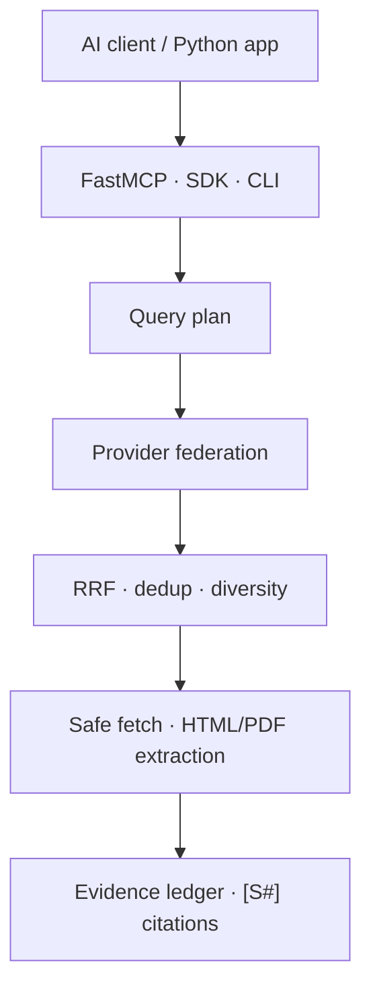

# EvidenceMesh

[](https://github.com/VynoDePal/EvidenceMesh/actions/workflows/ci.yml)
[](LICENSE)
[](pyproject.toml)
[](https://gofastmcp.com/)

Evidence-first, provider-neutral web search and deep-research infrastructure for
AI agents.

EvidenceMesh is a Python SDK, CLI and FastMCP server. It federates multiple
search engines, fuses their rankings, removes duplicates, extracts public
HTML/PDF content and returns compact evidence with stable `[S#]` citations.
The core works without a paid API or a bundled language model.

> **Status:** `0.1.0` alpha. The implementation is tested, but no claim of
> superior end-to-end research quality is made until comparable public
> benchmark runs are available.

## Why another search MCP?

Most search MCPs are thin wrappers around one paid API. Most deep-research
projects bundle a particular model, search service and report writer.
EvidenceMesh separates those concerns:

- **Free core:** self-hosted SearXNG, DDGS, Wikipedia and Crossref.
- **Provider federation:** reciprocal-rank fusion across independent result lists.
- **Evidence, not hidden answers:** quotations, retrieval time, content hash,
  provenance signals and risk flags.
- **Model neutral:** the MCP client keeps control of reasoning and synthesis.
- **Defensive retrieval:** public-network URL policy, redirect revalidation,
  byte limits, robots.txt, active-content removal and prompt-injection flags.
- **Reproducible evaluation:** deterministic algorithm benchmark plus a live
  retrieval harness for public QA datasets.

## Architecture



The calling model receives structured evidence and a synthesis protocol. Web
pages never become model instructions.

## Quick start

Requirements: Python 3.11+ and [uv](https://docs.astral.sh/uv/). Docker is
optional but recommended for the default SearXNG provider.

```bash
git clone https://github.com/VynoDePal/EvidenceMesh.git
cd EvidenceMesh
uv sync

# Start a private local SearXNG instance.
docker compose up -d searxng

uv run evidencemesh search "FastMCP HTTP transport" --fetch-content
uv run evidencemesh research "Compare open source deep-research systems"
```

If SearXNG is unavailable, the other configured providers still run and the
response contains an explicit partial-failure warning.

## MCP setup

### STDIO

Add this server to any MCP-compatible client. Replace `/absolute/path`:

```json
{
  "mcpServers": {
    "evidencemesh": {
      "command": "uv",
      "args": [
        "--directory",
        "/absolute/path/EvidenceMesh",
        "run",
        "evidencemesh-mcp"
      ]
    }
  }
}
```

### Streamable HTTP

```bash
uv run evidencemesh serve --transport http --host 127.0.0.1 --port 8000
```

The MCP endpoint is `http://127.0.0.1:8000/mcp`. A public deployment must add
TLS, authentication and rate limiting in front of the server.

## MCP tools

| Tool | Purpose |
|---|---|
| `search_web` | Federated search, ranking, deduplication and optional extraction |
| `deep_research` | Multi-query, citation-ready evidence packet |
| `fetch_url` | Bounded extraction of one public HTML, text or PDF URL |
| `batch_search` | Up to 20 searches with bounded concurrency |
| `verify_claim` | Collect evidence and counter-searches without a truth verdict |
| `health` | Provider and safety configuration without network calls |

The `evidence_first_research` MCP prompt provides a complete client-side
research workflow.

## Providers

| Provider | Key required | Default | Profiles |
|---|---:|---:|---|
| SearXNG | No | Yes | Web, news, academic, code |
| DDGS | No | Yes | Web, news, academic, code |
| Wikipedia | No | Yes | Web, academic |
| Crossref | No | Yes | Academic |
| Brave | Yes | No | Web, news, academic, code |
| Tavily | Yes | No | Web, news, academic, code |
| Exa | Yes | No | Web, news, academic, code |
| Firecrawl | Cloud only | No | Web, news, academic, code |

Select providers with:

```bash
export EVIDENCEMESH_PROVIDERS=searxng,ddgs,wikipedia,crossref
export EVIDENCEMESH_SEARXNG_URL=http://127.0.0.1:8888
```

Optional keys use `BRAVE_API_KEY`, `TAVILY_API_KEY`, `EXA_API_KEY` and
`FIRECRAWL_API_KEY`. A self-hosted Firecrawl endpoint can be selected with
`EVIDENCEMESH_FIRECRAWL_URL` and does not require a key.

See [provider documentation](docs/providers.md) for limitations and data flow.

## Python SDK

```python
import asyncio

from evidencemesh import EvidenceMesh, ResearchRequest


async def main() -> None:
    async with EvidenceMesh() as engine:
        packet = await engine.research(
            ResearchRequest(
                question="What changed in the latest stable FastMCP release?",
                language="en",
                max_sources=12,
            )
        )
        for item in packet.evidence:
            print(item.citation_id, item.title, item.url)


asyncio.run(main())
```

## Evaluation

```bash
# Unit, integration, MCP contract and safety tests.
uv run pytest

# Deterministic RRF/dedup regression benchmark.
uv run evidencemesh benchmark-offline

# Live retrieval evaluation using a local JSONL dataset.
uv run python benchmarks/run_live_retrieval.py \
  --dataset path/to/questions.jsonl \
  --limit 100
```

The offline benchmark tests algorithms, not real-world search quality. Live
results must record provider configuration, date, dataset sample and hardware.
See the [benchmark methodology](docs/benchmarking.md), the
[competitive snapshot](docs/competitive-benchmark.md) and the committed
[offline v1 result](benchmarks/results/offline_v1.md). A
[zero-key live smoke test](benchmarks/results/live_smoke_2026-07-28.md) records
connectivity and partial-failure behavior without presenting one question as a
quality score.

## Security

EvidenceMesh blocks private, loopback, link-local and reserved fetch targets by
default. It also limits redirects and bytes, respects robots.txt, strips active
HTML content and labels common prompt-injection patterns.

These controls are risk reduction, not a sandbox or a truth detector. Read the
[threat model](docs/threat-model.md) before remote deployment.

## Development

```bash
uv sync --extra dev
uv run ruff check .
uv run ruff format --check .
uv run mypy
uv run pytest
```

Contributions are welcome when benchmark claims are reproducible and provider
costs or quotas are stated explicitly. See [CONTRIBUTING.md](CONTRIBUTING.md).

The current local suite contains 108 tests and reports 92% branch-aware
coverage on Python 3.11. CI repeats the suite on Python 3.11, 3.12 and 3.13.

## License

EvidenceMesh is released under the [Apache License 2.0](LICENSE). SearXNG is a
separate service distributed under its own AGPL-3.0 license; EvidenceMesh only
communicates with it through its documented HTTP API.
