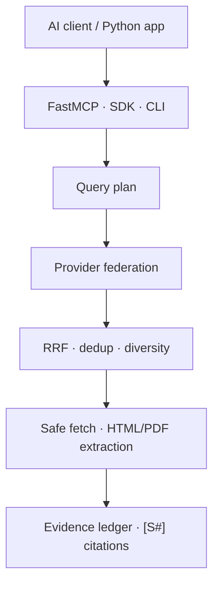

# EvidenceMesh

[](https://github.com/VynoDePal/EvidenceMesh/actions/workflows/ci.yml)
[](LICENSE)
[](pyproject.toml)
[](https://gofastmcp.com/)

Evidence-first, provider-neutral web search and deep-research infrastructure for
AI agents.

EvidenceMesh is a Python SDK, CLI and FastMCP server. It federates multiple
search engines, fuses their rankings, removes duplicates, extracts public
HTML/PDF content and returns compact evidence with stable `[S#]` citations.
The core works without a paid API or a bundled language model.

> **Status:** `0.1.0` alpha. The implementation is tested, but no claim of
> superior end-to-end research quality is made until comparable public
> benchmark runs are available.

## Why another search MCP?

Most search MCPs are thin wrappers around one paid API. Most deep-research
projects bundle a particular model, search service and report writer.
EvidenceMesh separates those concerns:

- **Free core:** self-hosted SearXNG, Wiby's independently crawled index,
  bounded DDGS fallback and direct Wikipedia, Crossref, arXiv and GitHub
  repository adapters.
- **Deterministic routing:** web, reference, academic and code sources receive
  only compatible queries, with conservative budgets for rate-limited APIs and
  profile-aware domain diversity.
- **Provider federation:** reciprocal-rank fusion across independent result lists.
- **Evidence, not hidden answers:** quotations, retrieval time, content hash,
  provenance signals and risk flags.
- **Model neutral:** the MCP client keeps control of reasoning and synthesis.
- **Defensive retrieval:** public-network URL policy, DNS-pinned connections,
  redirect revalidation, total deadlines, byte/page limits, bounded robots.txt,
  active-content removal and prompt-injection flags.
- **Reproducible evaluation:** deterministic algorithm benchmark plus a live
  retrieval harness for public QA datasets.

## Architecture



The calling model receives structured evidence and a synthesis protocol. Web
pages never become model instructions.

## Quick start

Requirements: Python 3.11+ and [uv](https://docs.astral.sh/uv/). Docker is
required for the recommended free general-web path because it runs the private
default SearXNG service.

```bash
git clone https://github.com/VynoDePal/EvidenceMesh.git
cd EvidenceMesh
uv sync

# Start a private local SearXNG instance.
docker compose up -d searxng

uv run evidencemesh search "FastMCP HTTP transport" --fetch-content
uv run evidencemesh research "Compare open source deep-research systems"
```

If SearXNG is unavailable, the other configured providers still run and the
response contains an explicit partial-failure warning. After three consecutive
failures, EvidenceMesh opens that provider's process-local circuit for 60
seconds so later searches do not repeatedly inherit its full deadline. One
half-open recovery probe is allowed after the cooldown.

## MCP setup

### STDIO

Add this server to any MCP-compatible client. Replace `/absolute/path`:

```json
{
  "mcpServers": {
    "evidencemesh": {
      "command": "uv",
      "args": [
        "--directory",
        "/absolute/path/EvidenceMesh",
        "run",
        "evidencemesh-mcp"
      ]
    }
  }
}
```

### Streamable HTTP

```bash
uv run evidencemesh serve --transport http --host 127.0.0.1 --port 8000
```

The MCP endpoint is `http://127.0.0.1:8000/mcp`. A public deployment must add
TLS, authentication and rate limiting in front of the server.

## MCP tools

| Tool | Purpose |
|---|---|
| `search_web` | Federated search, ranking, deduplication and optional extraction |
| `deep_research` | Multi-query, citation-ready evidence packet |
| `fetch_url` | Bounded extraction of one public HTML, text or PDF URL |
| `batch_search` | Up to 20 searches with bounded concurrency |
| `verify_claim` | Collect evidence and counter-searches without a truth verdict |
| `health` | Provider and safety configuration without network calls |

The `evidence_first_research` MCP prompt provides a complete client-side
research workflow.

## Providers

| Provider | Key required | `community` | `quality` | Profiles |
|---|---:|---:|---:|---|
| SearXNG | No | Yes | Yes | Web, news |
| Wiby | No | Yes | Yes | Web |
| Wikipedia | No | Yes | Yes | Web, reference, academic |
| Crossref | No | Yes | Yes | Academic |
| arXiv | No | Yes | Yes | Academic |
| GitHub repositories | No; token optional | Yes | Yes | Code |
| Tavily | Yes | No | Yes when configured | Web, news |
| OpenAlex | Free key | No | Explicit opt-in | Academic |
| Brave | Yes | No | Explicit opt-in | Web, news, academic, code |
| Exa | Yes | No | Explicit opt-in | Web, news, academic, code |
| Firecrawl | Cloud only | No | Explicit opt-in | Web, news, academic, code |
| DDGS | No | Yes | Yes | Web, news |

The default `community` profile requires no API key and remains a best-effort
self-hosted route. The recommended `quality` profile adds Tavily when
`TAVILY_API_KEY` is configured; a missing key produces a visible configuration
warning and a degraded health status. Other keyed adapters remain available
through an explicit provider list, but are not silently added to the
recommended quality bundle.

```bash
# Named bundles.
export EVIDENCEMESH_DEPLOYMENT_PROFILE=community  # or quality

# Required by the recommended quality profile.
export TAVILY_API_KEY=...

# An explicit list overrides the selected bundle.
export EVIDENCEMESH_PROVIDERS=searxng,ddgs,wiby,wikipedia,crossref,arxiv,github
export EVIDENCEMESH_SEARXNG_URL=http://127.0.0.1:8888
export EVIDENCEMESH_SEARXNG_FALLBACK_URLS=https://search-2.example
export EVIDENCEMESH_WIBY_URL=https://wiby.me/json/
export EVIDENCEMESH_PROVIDER_FAILURE_THRESHOLD=3
export EVIDENCEMESH_PROVIDER_RECOVERY_SECONDS=60

# Temporary Phase 11 quality retention policy (8 Tavily / 2 federation at limit 10).
export EVIDENCEMESH_QUALITY_PRIMARY_PROVIDER=tavily
export EVIDENCEMESH_QUALITY_PRIMARY_PROVIDER_SHARE=0.8
```

Optional keys use `OPENALEX_API_KEY`, `GITHUB_TOKEN`, `BRAVE_API_KEY`,
`TAVILY_API_KEY`, `EXA_API_KEY` and `FIRECRAWL_API_KEY`. A self-hosted
Firecrawl endpoint can be selected with `EVIDENCEMESH_FIRECRAWL_URL` and does
not require a key.

See [provider documentation](docs/providers.md) for limitations and data flow.

## Python SDK

```python
import asyncio

from evidencemesh import EvidenceMesh, ResearchRequest


async def main() -> None:
    async with EvidenceMesh() as engine:
        packet = await engine.research(
            ResearchRequest(
                question="What changed in the latest stable FastMCP release?",
                language="en",
                max_sources=12,
            )
        )
        for item in packet.evidence:
            print(item.citation_id, item.title, item.url)


asyncio.run(main())
```

## Evaluation

```bash
# Unit, integration, MCP contract and safety tests.
uv run pytest

# Deterministic RRF/dedup regression benchmark.
uv run evidencemesh benchmark-offline

# Interleaved zero-key retrieval pilot on checksum-pinned SimpleQA.
uv run python benchmarks/run_live_retrieval.py \
  --simpleqa \
  --sample-size 30 \
  --seed 0 \
  --max-results 10 \
  --output benchmarks/results/simpleqa_retrieval_pilot_2026-07-28.json
```

The offline benchmark tests algorithms, not real-world search quality. Live
results must record provider configuration, date, dataset sample and hardware.
See the [benchmark methodology](docs/benchmarking.md), the
[Phase 2/3 protocol](docs/benchmark-protocol-v1.md), the
[locked Phase 4 protocol](docs/benchmark-protocol-v2.md), the
[locked Phase 5 protocol](docs/benchmark-protocol-v3.md), the
[locked Phase 6 protocol](docs/benchmark-protocol-v4.md), the
[locked Phase 7 protocol](docs/benchmark-protocol-v5.md), the
[locked Phase 8 protocol](docs/benchmark-protocol-v6.md), the
[locked Phase 9 protocol](docs/benchmark-protocol-v7.md), the
[locked Phase 10 protocol](docs/benchmark-protocol-v8.md), the
[end-to-end guide](docs/end-to-end-benchmark.md), the
[competitive snapshot](docs/competitive-benchmark.md) and the committed
[offline v1 result](benchmarks/results/offline_v1.md). A
[zero-key live smoke test](benchmarks/results/live_smoke_2026-07-28.md) records
connectivity and partial-failure behavior without presenting one question as a
quality score. The
[30-row SimpleQA retrieval pilot](benchmarks/results/simpleqa_retrieval_pilot_2026-07-28.md)
is the first comparative live baseline; it records a no-go for superiority and
release claims. The
[200-row Phase 3 reliability run](benchmarks/results/simpleqa_retrieval_phase3_2026-07-28.md)
shows the circuit breaker reducing sustained federated p95 latency to 888 ms,
but only 70.5% availability; the release decision therefore remains no-go.
Phase 4 replaces that measured DDGS dependency with the private SearXNG
default, adds a provenance-locked 200-case GitHub benchmark, and introduces a
controlled end-to-end generation runner. The
[Phase 4 result](benchmarks/results/simpleqa_retrieval_phase4_2026-07-28.md)
found only 71.5% federated availability and a 98.0% partial-query failure rate
because the SearXNG upstream path became unavailable. The release decision
therefore remains no-go. No answer-quality score is claimed until the separate
official evaluator is run. Phase 5 calibrates eight keyless SearXNG engines on
a separate 12-query suite. Its pre-registered gate prevents tuning and
evaluating on the same SimpleQA questions: a new 200-case run is allowed only
if at least two engines pass every reliability and relevance threshold. The
valid
[Phase 5 calibration](benchmarks/results/searxng_calibration_phase5_2026-07-28.md)
found only one eligible engine: DuckDuckGo returned results for 12/12 cases and
found the target domain for 11/12, while every other candidate failed at least
one gate. Because `1 < 2`, production configuration is unchanged and the
200-case retrieval and local-model stages were not run. Phase 6 evaluates a
different, multi-source composition: DuckDuckGo is isolated behind private
SearXNG for general web, while direct reference, academic and repository
verticals add independent coverage. Its protocol requires successful
replication on two independently administered networks; that release gate
cannot be waived when only one environment is available. The
[Phase 6 calibration](benchmarks/results/multisource_calibration_phase6_2026-07-28.md)
returned results for 24/24 cases and hit the target domain and expected source
family for 22/24, with five providers and all four families contributing.
However, SearXNG failed in 8/12 routed cases, producing a 33.3% partial-failure
rate above the locked 25% maximum. The functional gate therefore failed, the
200-case stage was not run, and the release decision remains no-go. Phase 7
adds an explicit reference route, separates raw provider degradation from
required-family satisfaction, and freezes a new 32-case quality-profile
calibration. Tavily is capped at one basic request per web case and eight
credits for the complete run. The
[Phase 7 result](benchmarks/results/quality_calibration_phase7_2026-07-29.md)
found Tavily successful and contributing in 8/8 web cases, with all eight web
targets retrieved. The complete candidate nevertheless hit only 18/32 exact
targets because academic reached 2/8 and code reached 0/8. The functional,
two-network and release gates therefore remain closed, and Stage B was not
run. Phase 8 preserves that frozen result and evaluates the identified defects
on another untouched 32-case suite. It gives single-domain verticals all ten
result slots, normalizes natural-language repository intent for GitHub, matches
canonical target identities instead of URL prefixes, and records whether an
upstream target was later removed by ranking. Tavily remains capped at eight
basic calls. The protocol is locked before the first live request; the
two-network and release gates remain closed regardless of a one-network
functional result.

The
[Phase 8 result](benchmarks/results/quality_calibration_phase8_2026-07-29.md)
returned evidence and the required source family for 32/32 cases and hit 26/32
canonical targets, clearing every overall gate. Reference reached 8/8 and
academic 7/8, but repository code reached only 4/8 against the locked 6/8
minimum. Five of the six misses were absent upstream and one web target was
dropped by ranking. The per-topic functional gate therefore failed, Stage B
was not run, and the release decision remains no-go.

Phase 9 isolates the remaining repository-query defect with a paired
calibration: the frozen Phase 8 normalizer and the entity-anchor candidate run
against the same 24 new GitHub targets. Both arms remain anonymous, use exactly
one repository-search request per case, run without Tavily and are interleaved
below GitHub's documented anonymous search limit. Inputs, paired gates and
privacy rules are frozen in
[benchmark protocol v7](docs/benchmark-protocol-v7.md). The PR remains draft
regardless of the single-network result.

The
[Phase 9 result](benchmarks/results/github_recall_phase9_2026-07-29.md)
passed every functional gate. The entity-anchor candidate found 24/24
repositories in both GitHub's first 20 results and EvidenceMesh's final top
ten, versus 4/24 for the frozen Phase 8 strategy: 20 paired gains, zero
regressions and an exact two-sided McNemar p-value of 0.000002. This establishes
the narrow repository-query improvement on the locked suite, not general
search or deep-research superiority. The second-network gate remains
`not_testable`, Stage B remains blocked and release remains no-go.

Phase 10 introduces the first locked multi-model end-to-end pilot. Twelve
SimpleQA cases not used in Phase 3 are evaluated under four arms:
`closed_book`, one-query `tavily_direct`, zero-key EvidenceMesh `community` and
Tavily-backed EvidenceMesh `quality`. Retrieval packets are created once and
reused across `gemma-4-31b-it`, `gemma-4-26b-a4b-it` and
`gemini-3.5-flash-lite`, producing 36 retrieval case-arm operations and 144
generation calls with no retries and at most 24 Tavily requests.

The [Phase 10 protocol](docs/benchmark-protocol-v8.md) freezes the untouched
sample, native Gemini API payload, traffic, privacy rules, transparent
substring proxies and gates before the first model request. Those proxies are
not official SimpleQA accuracy or semantic citation judgments. External-agent
replication was deferred, the second network remains unavailable and the PR
stays draft regardless of the pilot result.

The
[Phase 10 result](benchmarks/results/end_to_end_phase10_2026-07-29.md)
failed the functional gate. One-query Tavily direct reached 27/36 generated
answer-key hits, versus 13/36 for EvidenceMesh quality, 6/36 for community and
0/36 closed-book. SearXNG degraded in every community and quality case;
community evidence was available for only 5/12 cases. Quality improved over
community by a paired net +7, but lost to Tavily direct by a paired net -14 and
missed its retrieval, answer and citation thresholds. The result identifies
provider reliability, fused-evidence retention and citation adherence as the
next engineering targets; release and superiority claims remain no-go.

The [Phase 11 protocol](docs/benchmark-protocol-v9.md) addresses those first two
retrieval defects without calling Gemini. It adds raw-to-prompt provider
lineage, compares 4/6, 6/4 and 8/2 Tavily reservations on one shared raw pool,
adds bounded DDGS redundancy and restores a checksum-pinned multi-engine
SearXNG configuration. The authored 12-case calibration uses at most 12 Tavily
requests. The Phase 10 sample is retired from future final evaluation, and
release remains no-go until a new untouched Phase 12 run and later external
agent replication.

The
[Phase 11 result](benchmarks/results/phase11_calibration_2026-07-29.md)
reached 12/12 availability and target-domain hit@10 for community, legacy
quality, 8/2 quality and Tavily direct. The 8/2 candidate recorded no paired
target-domain loss, but filled its eight reserved Tavily slots in only 10/12
evaluable cases because the per-domain diversity cap constrained two cases.
SearXNG failed completely in 4/12 cases and was partial in 8/12; direct DDGS
kept community available, but does not provide an index independent from the
only surviving SearXNG engine. The frozen candidate gate therefore failed,
Phase 12 remains blocked and release remains no-go.

The corrective
[Phase 11.1 protocol](docs/benchmark-protocol-v10.md) leaves that historical
failure unchanged. It separates requested, eligible, domain-feasible, target
and fulfilled reservation counts, and adds Wiby as a bounded zero-key source
with a genuinely independent crawler/index. Its authored calibration reuses
the Phase 11 diagnostic suite transparently, makes no model call and keeps the
PR, release and superiority claims blocked regardless of the result.

## Security

EvidenceMesh blocks private, loopback, link-local and reserved fetch targets by
default. Document connections are pinned to the public addresses that passed
validation. It also limits redirects, time, bytes and PDF pages; bounds and
respects robots.txt; strips active HTML content; and labels common
prompt-injection patterns.

These controls are risk reduction, not a sandbox or a truth detector. Read the
[threat model](docs/threat-model.md) before remote deployment. The dated
[v0.1 security and release audit](docs/security-audit-v0.1.md) records the
closed findings, test methods and residual risks.

## Development

```bash
uv sync --extra dev
uv run ruff check .
uv run ruff format --check .
uv run mypy
uv run pytest
```

Contributions are welcome when benchmark claims are reproducible and provider
costs or quotas are stated explicitly. See [CONTRIBUTING.md](CONTRIBUTING.md).

The current suite contains 273 tests and reports 91.71% branch-aware coverage
locally. CI repeats the suite on Python 3.11, 3.12 and 3.13.

## License

EvidenceMesh is released under the [Apache License 2.0](LICENSE). SearXNG is a
separate service distributed under its own AGPL-3.0 license; EvidenceMesh only
communicates with it through its documented HTTP API.
