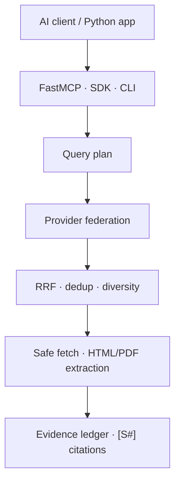

# EvidenceMesh

[](https://github.com/VynoDePal/EvidenceMesh/actions/workflows/ci.yml)
[](LICENSE)
[](pyproject.toml)
[](https://gofastmcp.com/)

Evidence-first, provider-neutral web search and deep-research infrastructure for
AI agents.

EvidenceMesh is a Python SDK, CLI and FastMCP server. It federates multiple
search engines, fuses their rankings, removes duplicates, extracts public
HTML/PDF content and returns compact evidence with stable `[S#]` citations.
The core works without a paid API or a bundled language model.

> **Status:** the exact tag `v0.1.0-alpha.local` is accepted as an offline,
> single-host technical alpha. The implementation is tested, but this is not
> V1 readiness and no superior end-to-end research-quality claim is made.
>
> **Distribution:** the accepted tag remains local and unpublished. No PyPI
> package, GitHub Release or public binary has been published. See the
> [acceptance protocol](docs/local-technical-alpha-v0.1.0-acceptance-protocol-v1.md)
> and [no-response policy](docs/local-technical-alpha-v0.1.0-policy-v1.md). The
> [public projection](alpha/local_technical_alpha_v0_1_0_public_projection_v1.json)
> binds that local record to the tree-identical public source commit without
> publishing the local tag, distributions or a release.
>
> **Public source:** until this draft pull request is merged, `main` is only a
> repository skeleton and is not installable. Use the exact alpha branch and
> commit in the Quick Start below.

## Why another search MCP?

Most search MCPs are thin wrappers around one paid API. Most deep-research
projects bundle a particular model, search service and report writer.
EvidenceMesh separates those concerns:

- **Free core:** self-hosted SearXNG, bounded DDGS fallback and direct
  Wikipedia, Crossref, arXiv and GitHub repository adapters; Mwmbl, Wiby and
  self-hosted YaCy independent indexes are available as explicit opt-ins.
- **Deterministic routing:** web, reference, academic and code sources receive
  only compatible queries, with conservative budgets for rate-limited APIs and
  profile-aware domain diversity.
- **Provider federation:** reciprocal-rank fusion across independent result lists.
- **Privacy-safe network observability:** logical calls, cache hits, circuit
  skips, adapter invocations and shared-client HTTP attempts are reported
  separately without storing queries, URLs or response bodies.
- **Evidence, not hidden answers:** quotations, retrieval time, content hash,
  provenance signals and risk flags.
- **Model neutral:** the MCP client keeps control of reasoning and synthesis.
- **Defensive retrieval:** public-network URL policy, DNS-pinned connections,
  redirect revalidation, total deadlines, byte/page limits, bounded robots.txt,
  active-content removal and prompt-injection flags.
- **Reproducible evaluation:** deterministic algorithm benchmark plus a live
  retrieval harness for public QA datasets.

## Architecture



The calling model receives structured evidence and a synthesis protocol. Web
pages never become model instructions.

## Quick start

This source-only path requires Git, Python 3.11 and
[uv](https://docs.astral.sh/uv/) `0.11.33`. It needs no API key or Docker
service. `main` is temporarily not installable, so the branch and full commit
identity are both checked before installation.

```bash
ALPHA_BRANCH=agent/evidencemesh-v0.1
ALPHA_SHA=145f5f923825ffeaeb485bd680bc79410ab290d1

git clone \
  --branch "$ALPHA_BRANCH" \
  --single-branch \
  --no-tags \
  https://github.com/VynoDePal/EvidenceMesh.git
cd EvidenceMesh

# Preserve the branch-head MCP template before detaching the product source.
ALPHA_DESCRIPTOR="$(mktemp)"
cp examples/evidencemesh.mcp.json "$ALPHA_DESCRIPTOR"
chmod 0600 "$ALPHA_DESCRIPTOR"
printf '%s\n' "$ALPHA_DESCRIPTOR"

git checkout --detach "$ALPHA_SHA"
test "$(git rev-parse HEAD)" = "$ALPHA_SHA"

uv sync --locked --no-dev --no-editable --python 3.11

# These checks are offline and make no provider or model request.
ALPHA_STATE_DIR="$(mktemp -d)"
export EVIDENCEMESH_CACHE_PATH="$ALPHA_STATE_DIR/cache.sqlite3"
export FASTMCP_CHECK_FOR_UPDATES=off
EVIDENCEMESH_PROVIDERS=wikipedia .venv/bin/evidencemesh providers
EVIDENCEMESH_PROVIDERS=wikipedia .venv/bin/evidencemesh benchmark-offline
```

The Alpha A1-P0 path above was validated on Ubuntu 24.04 x86_64. CI exercises
Python 3.11, 3.12 and 3.13. macOS has not been validated, and native Windows is
not supported in this alpha.

### Optional live search with SearXNG

Docker is required only for this optional live step. It starts the private,
checksum-pinned SearXNG service and performs a real external search without an
API key. Provider availability and returned Web results are not part of the
offline installation gate.

```bash
docker compose up --detach --wait searxng

EVIDENCEMESH_PROVIDERS=searxng \
  .venv/bin/evidencemesh search \
  "FastMCP HTTP transport" \
  --fetch-content
```

With the single-provider override above, an unavailable SearXNG leaves no other
provider to answer. In a multi-provider configuration, the remaining providers
still run and the response contains an explicit partial-failure warning. After
three consecutive failures, EvidenceMesh opens the failing provider's
process-local circuit for 60 seconds. One half-open recovery probe is allowed
after the cooldown.

## MCP setup

### STDIO

EvidenceMesh publishes the descriptor below as its tested Ubuntu STDIO shape.
The `mcpServers` configuration schema is common but is not universal: first
confirm that your client supports STDIO servers and per-server `env` values.
Replace both example paths with absolute paths; JSON clients are not required
to expand `$HOME`, `$PWD` or shell expressions. Create the private cache parent
before starting the client:

```bash
install -d -m 0700 /home/YOUR_USER/.cache/evidencemesh
```

```json
{
  "mcpServers": {
    "evidencemesh": {
      "command": "/absolute/path/to/EvidenceMesh/.venv/bin/evidencemesh-mcp",
      "args": [],
      "env": {
        "EVIDENCEMESH_ALLOW_NONSTANDARD_PORTS": "false",
        "EVIDENCEMESH_ALLOW_PRIVATE_NETWORKS": "false",
        "EVIDENCEMESH_CACHE_PATH": "/home/YOUR_USER/.cache/evidencemesh/cache.sqlite3",
        "EVIDENCEMESH_DEPLOYMENT_PROFILE": "community",
        "EVIDENCEMESH_PROVIDERS": "wikipedia",
        "EVIDENCEMESH_RESPECT_ROBOTS_TXT": "true",
        "EVIDENCEMESH_TRANSPORT": "stdio",
        "FASTMCP_CHECK_FOR_UPDATES": "off",
        "FASTMCP_SHOW_SERVER_BANNER": "false",
        "PYTHONUNBUFFERED": "1"
      }
    }
  }
}
```

This exact shape is also available as
[`examples/evidencemesh.mcp.json`](examples/evidencemesh.mcp.json). The Quick
Start preserves it at the shell path printed by `printf '%s\n'
"$ALPHA_DESCRIPTOR"` before detaching the older frozen product source. Replace
the paths in that preserved copy, then add its JSON to your client. On first
connection, call only `health`: the expected local result is EvidenceMesh
`0.1.0`, status `ready`, profile `community`, provider `wikipedia`, no
configuration warning, private networks disabled and DNS pinning enabled.
`ready` describes local configuration; it does not prove that Wikipedia is
reachable or that a live search will succeed. The A1-P1 gate validated this
headless path with the official Python MCP SDK on Ubuntu 24.04 and did not test
a GUI host, macOS or native Windows. A1-P2 additionally loaded a private copy
of the same descriptor through the official MCP Inspector CLI 2.0.0 and called
`health` in one Ubuntu STDIO session. MCP Inspector is a developer testing
client, not an AI application host: this does not establish compatibility with
Claude Desktop, Cursor, VS Code, ChatGPT or every MCP client. FastMCP
diagnostics remain enabled on stderr; MCP JSON-RPC remains isolated on stdout.

### Streamable HTTP (advanced; outside A1-P2)

```bash
.venv/bin/evidencemesh serve --transport http --host 127.0.0.1 --port 8000
```

The MCP endpoint is `http://127.0.0.1:8000/mcp`. A public deployment must add
TLS, authentication and rate limiting in front of the server.

## MCP tools

| Tool | Purpose |
|---|---|
| `search_web` | Federated search, ranking, deduplication and optional extraction |
| `deep_research` | Multi-query, citation-ready evidence packet |
| `fetch_url` | Bounded extraction of one public HTML, text or PDF URL |
| `batch_search` | Up to 20 searches with bounded concurrency |
| `verify_claim` | Collect evidence and counter-searches without a truth verdict |
| `health` | Provider and safety configuration without network calls |

The `evidence_first_research` MCP prompt provides a complete client-side
research workflow.

## Providers

| Provider | Key required | `community` | `quality` | Profiles |
|---|---:|---:|---:|---|
| SearXNG | No | Yes | Yes | Web, news |
| Mwmbl | No | Explicit opt-in | Explicit opt-in | Web |
| Wiby | No | Explicit opt-in | Explicit opt-in | Web |
| YaCy | No; self-hosted | Explicit opt-in | Explicit opt-in | Web |
| Wikipedia | No | Yes | Yes | Web, reference, academic |
| Crossref | No | Yes | Yes | Academic |
| arXiv | No | Yes | Yes | Academic |
| GitHub repositories | No; token optional | Yes | Yes | Code |
| Tavily | Yes | No | Yes when configured | Web, news |
| OpenAlex | Free key | No | Explicit opt-in | Academic |
| Brave | Yes | No | Explicit opt-in | Web, news, academic, code |
| Exa | Yes | No | Explicit opt-in | Web, news, academic, code |
| Firecrawl | Cloud only | No | Explicit opt-in | Web, news, academic, code |
| DDGS | No | Yes | Yes | Web, news |

The default `community` profile requires no API key and remains a best-effort
self-hosted route. Mwmbl, Wiby and YaCy remain explicit opt-ins: Mwmbl search
results carry a CC BY-NC-SA 4.0 notice, Wiby failed its Phase 11.1 candidate
gates, and YaCy quality depends on the operator's populated index. The
recommended `quality` profile adds Tavily when `TAVILY_API_KEY` is configured;
a missing key produces a visible configuration warning and a degraded health
status. Other keyed adapters remain available through an explicit provider
list, but are not silently added to the recommended quality bundle.

```bash
# Named bundles.
export EVIDENCEMESH_DEPLOYMENT_PROFILE=community  # or quality

# Required by the recommended quality profile.
export TAVILY_API_KEY=...

# An explicit list overrides the selected bundle.
export EVIDENCEMESH_PROVIDERS=searxng,ddgs,wiby,wikipedia,crossref,arxiv,github
export EVIDENCEMESH_SEARXNG_URL=http://127.0.0.1:8888
export EVIDENCEMESH_SEARXNG_FALLBACK_URLS=https://search-2.example
export EVIDENCEMESH_WIBY_URL=https://wiby.me/json/
export EVIDENCEMESH_MWMBL_URL=https://api.mwmbl.org/api/v2/search/
export EVIDENCEMESH_YACY_URL=http://127.0.0.1:8090
export EVIDENCEMESH_YACY_RESOURCE=local
export EVIDENCEMESH_PROVIDER_FAILURE_THRESHOLD=3
export EVIDENCEMESH_PROVIDER_RECOVERY_SECONDS=60
export EVIDENCEMESH_REQUEST_TIMEOUT=15
export EVIDENCEMESH_PROVIDER_CONNECT_TIMEOUT=5
export EVIDENCEMESH_PROVIDER_READ_TIMEOUT=12
export EVIDENCEMESH_PROVIDER_WRITE_TIMEOUT=10
export EVIDENCEMESH_PROVIDER_POOL_TIMEOUT=5

# Temporary Phase 11 quality retention policy (8 Tavily / 2 federation at limit 10).
export EVIDENCEMESH_QUALITY_PRIMARY_PROVIDER=tavily
export EVIDENCEMESH_QUALITY_PRIMARY_PROVIDER_SHARE=0.8
```

Optional keys use `OPENALEX_API_KEY`, `GITHUB_TOKEN`, `BRAVE_API_KEY`,
`TAVILY_API_KEY`, `EXA_API_KEY` and `FIRECRAWL_API_KEY`. A self-hosted
Firecrawl endpoint can be selected with `EVIDENCEMESH_FIRECRAWL_URL` and does
not require a key.

EvidenceMesh-owned HTTP clients use separate connect, read, write and connection
pool deadlines under the provider wall deadline. The wall must be strictly
greater than every transport deadline. Runtime metadata distinguishes
`connect_timeout`, `read_timeout`, `write_timeout`, `pool_timeout`,
`httpx_timeout_unknown` and `provider_wall_timeout` without exposing exception
messages, request data or credentials. A caller-supplied HTTPX client retains
its own timeout policy.

See [provider documentation](docs/providers.md) for limitations and data flow.

## Python SDK

```python
import asyncio

from evidencemesh import EvidenceMesh, ResearchRequest


async def main() -> None:
    async with EvidenceMesh() as engine:
        packet = await engine.research(
            ResearchRequest(
                question="What changed in the latest stable FastMCP release?",
                language="en",
                max_sources=12,
            )
        )
        for item in packet.evidence:
            print(item.citation_id, item.title, item.url)


asyncio.run(main())
```

## Evaluation

```bash
# Unit, integration, MCP contract and safety tests.
.venv/bin/pytest

# Deterministic RRF/dedup regression benchmark.
.venv/bin/evidencemesh benchmark-offline

# Interleaved zero-key retrieval pilot on checksum-pinned SimpleQA.
.venv/bin/python benchmarks/run_live_retrieval.py \
  --simpleqa \
  --sample-size 30 \
  --seed 0 \
  --max-results 10 \
  --output benchmarks/results/simpleqa_retrieval_pilot_2026-07-28.json
```

The offline benchmark tests algorithms, not real-world search quality. Live
results must record provider configuration, date, dataset sample and hardware.
See the [benchmark methodology](docs/benchmarking.md), the
[Phase 2/3 protocol](docs/benchmark-protocol-v1.md), the
[locked Phase 4 protocol](docs/benchmark-protocol-v2.md), the
[locked Phase 5 protocol](docs/benchmark-protocol-v3.md), the
[locked Phase 6 protocol](docs/benchmark-protocol-v4.md), the
[locked Phase 7 protocol](docs/benchmark-protocol-v5.md), the
[locked Phase 8 protocol](docs/benchmark-protocol-v6.md), the
[locked Phase 9 protocol](docs/benchmark-protocol-v7.md), the
[locked Phase 10 protocol](docs/benchmark-protocol-v8.md), the
[end-to-end guide](docs/end-to-end-benchmark.md), the
[competitive snapshot](docs/competitive-benchmark.md) and the committed
[offline v1 result](benchmarks/results/offline_v1.md). A
[zero-key live smoke test](benchmarks/results/live_smoke_2026-07-28.md) records
connectivity and partial-failure behavior without presenting one question as a
quality score. The
[30-row SimpleQA retrieval pilot](benchmarks/results/simpleqa_retrieval_pilot_2026-07-28.md)
is the first comparative live baseline; it records a no-go for superiority and
release claims. The
[200-row Phase 3 reliability run](benchmarks/results/simpleqa_retrieval_phase3_2026-07-28.md)
shows the circuit breaker reducing sustained federated p95 latency to 888 ms,
but only 70.5% availability; the release decision therefore remains no-go.
Phase 4 replaces that measured DDGS dependency with the private SearXNG
default, adds a provenance-locked 200-case GitHub benchmark, and introduces a
controlled end-to-end generation runner. The
[Phase 4 result](benchmarks/results/simpleqa_retrieval_phase4_2026-07-28.md)
found only 71.5% federated availability and a 98.0% partial-query failure rate
because the SearXNG upstream path became unavailable. The release decision
therefore remains no-go. No answer-quality score is claimed until the separate
official evaluator is run. Phase 5 calibrates eight keyless SearXNG engines on
a separate 12-query suite. Its pre-registered gate prevents tuning and
evaluating on the same SimpleQA questions: a new 200-case run is allowed only
if at least two engines pass every reliability and relevance threshold. The
valid
[Phase 5 calibration](benchmarks/results/searxng_calibration_phase5_2026-07-28.md)
found only one eligible engine: DuckDuckGo returned results for 12/12 cases and
found the target domain for 11/12, while every other candidate failed at least
one gate. Because `1 < 2`, production configuration is unchanged and the
200-case retrieval and local-model stages were not run. Phase 6 evaluates a
different, multi-source composition: DuckDuckGo is isolated behind private
SearXNG for general web, while direct reference, academic and repository
verticals add independent coverage. Its protocol requires successful
replication on two independently administered networks; that release gate
cannot be waived when only one environment is available. The
[Phase 6 calibration](benchmarks/results/multisource_calibration_phase6_2026-07-28.md)
returned results for 24/24 cases and hit the target domain and expected source
family for 22/24, with five providers and all four families contributing.
However, SearXNG failed in 8/12 routed cases, producing a 33.3% partial-failure
rate above the locked 25% maximum. The functional gate therefore failed, the
200-case stage was not run, and the release decision remains no-go. Phase 7
adds an explicit reference route, separates raw provider degradation from
required-family satisfaction, and freezes a new 32-case quality-profile
calibration. Tavily is capped at one basic request per web case and eight
credits for the complete run. The
[Phase 7 result](benchmarks/results/quality_calibration_phase7_2026-07-29.md)
found Tavily successful and contributing in 8/8 web cases, with all eight web
targets retrieved. The complete candidate nevertheless hit only 18/32 exact
targets because academic reached 2/8 and code reached 0/8. The functional,
two-network and release gates therefore remain closed, and Stage B was not
run. Phase 8 preserves that frozen result and evaluates the identified defects
on another untouched 32-case suite. It gives single-domain verticals all ten
result slots, normalizes natural-language repository intent for GitHub, matches
canonical target identities instead of URL prefixes, and records whether an
upstream target was later removed by ranking. Tavily remains capped at eight
basic calls. The protocol is locked before the first live request; the
two-network and release gates remain closed regardless of a one-network
functional result.

The
[Phase 8 result](benchmarks/results/quality_calibration_phase8_2026-07-29.md)
returned evidence and the required source family for 32/32 cases and hit 26/32
canonical targets, clearing every overall gate. Reference reached 8/8 and
academic 7/8, but repository code reached only 4/8 against the locked 6/8
minimum. Five of the six misses were absent upstream and one web target was
dropped by ranking. The per-topic functional gate therefore failed, Stage B
was not run, and the release decision remains no-go.

Phase 9 isolates the remaining repository-query defect with a paired
calibration: the frozen Phase 8 normalizer and the entity-anchor candidate run
against the same 24 new GitHub targets. Both arms remain anonymous, use exactly
one repository-search request per case, run without Tavily and are interleaved
below GitHub's documented anonymous search limit. Inputs, paired gates and
privacy rules are frozen in
[benchmark protocol v7](docs/benchmark-protocol-v7.md). The PR remains draft
regardless of the single-network result.

The
[Phase 9 result](benchmarks/results/github_recall_phase9_2026-07-29.md)
passed every functional gate. The entity-anchor candidate found 24/24
repositories in both GitHub's first 20 results and EvidenceMesh's final top
ten, versus 4/24 for the frozen Phase 8 strategy: 20 paired gains, zero
regressions and an exact two-sided McNemar p-value of 0.000002. This establishes
the narrow repository-query improvement on the locked suite, not general
search or deep-research superiority. The second-network gate remains
`not_testable`, Stage B remains blocked and release remains no-go.

Phase 10 introduces the first locked multi-model end-to-end pilot. Twelve
SimpleQA cases not used in Phase 3 are evaluated under four arms:
`closed_book`, one-query `tavily_direct`, zero-key EvidenceMesh `community` and
Tavily-backed EvidenceMesh `quality`. Retrieval packets are created once and
reused across `gemma-4-31b-it`, `gemma-4-26b-a4b-it` and
`gemini-3.5-flash-lite`, producing 36 retrieval case-arm operations and 144
generation calls with no retries and at most 24 Tavily requests.

The [Phase 10 protocol](docs/benchmark-protocol-v8.md) freezes the untouched
sample, native Gemini API payload, traffic, privacy rules, transparent
substring proxies and gates before the first model request. Those proxies are
not official SimpleQA accuracy or semantic citation judgments. External-agent
replication was deferred, the second network remains unavailable and the PR
stays draft regardless of the pilot result.

The
[Phase 10 result](benchmarks/results/end_to_end_phase10_2026-07-29.md)
failed the functional gate. One-query Tavily direct reached 27/36 generated
answer-key hits, versus 13/36 for EvidenceMesh quality, 6/36 for community and
0/36 closed-book. SearXNG degraded in every community and quality case;
community evidence was available for only 5/12 cases. Quality improved over
community by a paired net +7, but lost to Tavily direct by a paired net -14 and
missed its retrieval, answer and citation thresholds. The result identifies
provider reliability, fused-evidence retention and citation adherence as the
next engineering targets; release and superiority claims remain no-go.

The [Phase 11 protocol](docs/benchmark-protocol-v9.md) addresses those first two
retrieval defects without calling Gemini. It adds raw-to-prompt provider
lineage, compares 4/6, 6/4 and 8/2 Tavily reservations on one shared raw pool,
adds bounded DDGS redundancy and restores a checksum-pinned multi-engine
SearXNG configuration. The authored 12-case calibration uses at most 12 Tavily
requests. The Phase 10 sample is retired from future final evaluation, and
release remains no-go until a new untouched Phase 12 run and later external
agent replication.

The
[Phase 11 result](benchmarks/results/phase11_calibration_2026-07-29.md)
reached 12/12 availability and target-domain hit@10 for community, legacy
quality, 8/2 quality and Tavily direct. The 8/2 candidate recorded no paired
target-domain loss, but filled its eight reserved Tavily slots in only 10/12
evaluable cases because the per-domain diversity cap constrained two cases.
SearXNG failed completely in 4/12 cases and was partial in 8/12; direct DDGS
kept community available, but does not provide an index independent from the
only surviving SearXNG engine. The frozen candidate gate therefore failed,
Phase 12 remains blocked and release remains no-go.

The corrective
[Phase 11.1 protocol](docs/benchmark-protocol-v10.md) leaves that historical
failure unchanged. It separates requested, eligible, domain-feasible, target
and fulfilled reservation counts, and adds Wiby as a bounded zero-key source
with a genuinely independent crawler/index. Its authored calibration reuses
the Phase 11 diagnostic suite transparently, makes no model call and keeps the
PR, release and superiority claims blocked regardless of the result.

The
[Phase 11.1 result](benchmarks/results/phase11_1_calibration_2026-07-29.md)
also failed. The domain-aware target was fulfilled in 12/12 cases, but its
aggregate strength was 89/96 against a frozen minimum of 90. Wiby returned
results in 4/12 cases and none survived community top-10 selection. The adapter
therefore remains available by explicit provider configuration but is not
promoted into the default bundles. Phase 12 remains blocked.

The [Phase 11.2 protocol](docs/benchmark-protocol-v11.md) evaluates a larger
independent public index without a paid API or model call. It freezes a new
16-case broad-Web/long-tail suite and compares legacy community, complete
candidate, Mwmbl direct, Wiby direct and independent fused arms from one raw
pool. Mwmbl is integrated with explicit result-license metadata, while an
optional checksum-pinned YaCy service provides the operator-controlled path.
The [architecture assessment](docs/independent-index-assessment-v1.md) records
the alternatives and rejection reasons. Both providers stay outside named
defaults, Phase 12 stays blocked, and release remains no-go regardless of this
calibration's retrieval score.

The published
[Phase 11.2 result](benchmarks/results/phase11_2_independent_index_2026-07-29.md)
failed its retrieval gates. Legacy and candidate community both reached 16/16
availability and 15/16 target-domain hit@10, with 16 paired ties. Mwmbl
returned no raw result in 16 routed cases, while Wiby provided prompt evidence
in 7/16 and hit one target domain. The independent fused arm therefore reached
only 7/16 availability against the frozen 12/16 minimum. The report also
identifies a telemetry gap: routed calls were counted, but actual HTTP attempts
and circuit-open skips were not separated. No opportunistic rerun was made;
named bundles remain unchanged and Phase 12 remains blocked.

The [Phase 11.3 protocol](docs/benchmark-protocol-v12.md) corrects that
observability gap before any further scored retrieval work. Core search
metadata now separates routed logical calls, cache hits, circuit skips,
adapter invocations, dispatched HTTP attempts and received responses, with
sanitized timeout, DNS, connection, HTTP, JSON and schema failure classes.
Its four-query Mwmbl workflow is explicitly non-scored, makes no paid-provider
or model call, emits no query or result content and cannot promote a provider
or unlock Phase 12. A broad YaCy run is excluded because no persistent,
reproducibly populated index is available.

The published
[Phase 11.3 result](benchmarks/results/phase11_3_network_diagnostic_2026-07-29.md)
records four logical calls, four adapter invocations and four actual HTTP
attempts. Three received HTTP 200 responses and returned ten rows; one failed
without a response at the 15-second deadline and was classified directly as a
timeout. No call came from cache or was skipped by the circuit. This validates
the observability contract and shows intermittent Mwmbl endpoint behavior; it
does not measure relevance or change any default, Phase 12 or release decision.

The [Phase 11.4 alpha RC protocol](docs/alpha-rc-protocol-v1.md) is a separate
distribution-engineering gate. It builds a wheel and source distribution,
installs the wheel in an isolated environment, negotiates MCP through the
installed `evidencemesh-mcp` command over a real STDIO subprocess, generates a
CycloneDX 1.7 SBOM and has GitHub create and verify keyless SLSA provenance
and SBOM attestations. It makes no provider or model request. A technical pass
does not score search quality and cannot authorize PyPI, a GitHub Release,
merge, Phase 12 or a superiority claim. See the
[alpha distribution guide](docs/alpha-release-v0.1.md) for the exact boundary
and verification procedure.

The [Phase 11.5 protocol](docs/benchmark-protocol-v13.md) returns to the
unresolved answer-quality failure. It reuses the Phase 10 cases transparently,
collects one raw provider pool per case, and compares Tavily direct, current
8/2 quality and a provider-aware prompt candidate across the same three
models. The candidate balances prompt space across all selected blocks and
enforces exact packet-local citations with deterministic ID validation.
Traffic is capped at 12 Tavily and 108 model requests with no retry or repair.
The [audited result](benchmarks/results/phase11_5_quality_recovery_2026-07-29.md)
passed six of eight gates but failed completion and answer non-regression.
Candidate citations reached 94.1% presence, 100% valid IDs and 76.5% support
proxy, while answer-key hits remained 25/36 versus 28/36 for Tavily direct.
Community retrieval remains visible but non-blocking; Phase 12, merge,
publication and superiority claims remain blocked.

The [Phase 11.6 protocol](docs/benchmark-protocol-v14.md) freezes a narrower
causal calibration before any scored request. It retrieves one Tavily packet
per reused case, then gives the byte-identical selected and projected evidence
to legacy and strict citation prompts. The matrix includes
`gemma-4-31b-it`, blocking `gemma-4-26b-a4b-it` and
`gemini-3.5-flash-lite`: exactly 12 Tavily and 72 model requests, with no
retry, fallback or repair. Only a ten-gate pass may promote the paid `quality`
default to Tavily only in a separate result commit. The free `community`
profile remains unchanged, and Phase 12 is not executed. The
[audited result](benchmarks/results/phase11_6_tavily_citation_isolation_2026-07-29.md)
passed nine of ten gates. Strict and legacy answer-key hits tied at 25/36,
while strict citations reached 100% presence, 100% identifier validity and
82.4% support proxy. Blocking Gemma 26B completed only 10/12 calls in each
arm, so the quality profile was not promoted and Phase 12 remains blocked.

The [Phase 11.7 protocol](docs/benchmark-protocol-v15.md) freezes a fresh
24-case confirmation before any new request and seals a disjoint 96-case
Phase 12 reserve without committing its questions, answers or distributions.
It repeats the byte-identical Tavily legacy/strict prompt comparison across
blocking `gemma-4-31b-it` and `gemini-3.5-flash-lite`, for exactly 24 Tavily
and 96 model requests with no retry or repair. Gemma 26B remains available as
a user-chosen model but is neither called nor blocking in this calibration.
Only a ten-gate pass may promote the optional API-backed `quality` profile to
Tavily only in a separate result commit. The zero-key `community` profile
stays unchanged; the PR remains draft and the sealed Phase 12 evaluation is
not executed.

The
[audited result](benchmarks/results/phase11_7_fresh_confirmation_2026-07-29.md)
passed seven of ten gates. Both blocking models completed 24/24 calls per arm,
and strict versus legacy answer-key coverage tied at 32/48 with paired net
zero. Strict citations improved to 45/48 presence with 45/45 valid IDs, but
missed the frozen 95% presence floor; support proxy reached 33/48 against a
36/48 minimum, and prompt evidence was answer-bearing for 18/24 cases against
a 20/24 minimum. The quality profile was not promoted and Phase 12 remains
blocked.

The [Phase 11.8 protocol](docs/benchmark-protocol-v16.md) freezes a corrective
calibration on those already-observed 24 cases. One Tavily pool of up to 20
results per case feeds `current_strict`, `expanded_strict` and
`expanded_structured`; the latter two receive byte-identical expanded
evidence. The structured arm uses a strictly parsed claim-and-citation JSON
contract with no repair or fallback. The manual live budget is exactly 24
Tavily and 144 generation requests across blocking `gemma-4-31b-it` and
`gemini-3.5-flash-lite`, with zero retries. Pull-request checks are offline and
receive no API credentials unless a maintainer deliberately adds the exact
`phase11.8-live-authorized` label in a same-repository `labeled` event. A
manual dispatch with an explicit boolean remains available once the workflow
exists on the default branch.

All twelve pre-registered gates must pass. Because the cases are observed, a
pass may authorize only the design of a separate fresh Phase 11.9
confirmation. It cannot promote the quality profile, consume the sealed Phase
12 reserve, run an external-agent benchmark, merge the draft PR, publish a
release or support a superiority claim. No Phase 11.8 live request or result
is included in this protocol-lock commit.

## Security

EvidenceMesh blocks private, loopback, link-local and reserved fetch targets by
default. Document connections are pinned to the public addresses that passed
validation. It also limits redirects, time, bytes and PDF pages; bounds and
respects robots.txt; strips active HTML content; and labels common
prompt-injection patterns.

These controls are risk reduction, not a sandbox or a truth detector. Read the
[threat model](docs/threat-model.md) before remote deployment. The dated
[v0.1 security and release audit](docs/security-audit-v0.1.md) records the
closed findings, test methods and residual risks.

## Development

```bash
uv sync --locked --extra dev --python 3.11
.venv/bin/ruff check .
.venv/bin/ruff format --check .
.venv/bin/mypy
.venv/bin/pytest
```

Contributions are welcome when benchmark claims are reproducible and provider
costs or quotas are stated explicitly. See [CONTRIBUTING.md](CONTRIBUTING.md).

The current suite contains 372 tests and reports 91.55% branch-aware coverage
locally. CI repeats the suite on Python 3.11, 3.12 and 3.13 and installs the
built wheel before exercising its CLI and real MCP STDIO entry point.

## License

EvidenceMesh is released under the [Apache License 2.0](LICENSE). SearXNG,
Mwmbl and YaCy are separate projects distributed under their own licenses;
EvidenceMesh only communicates with them through documented HTTP APIs. Mwmbl
result-license metadata is preserved in every applicable search response.
